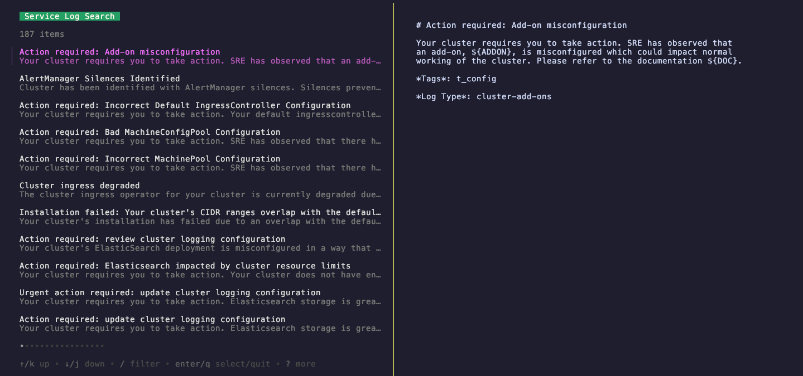
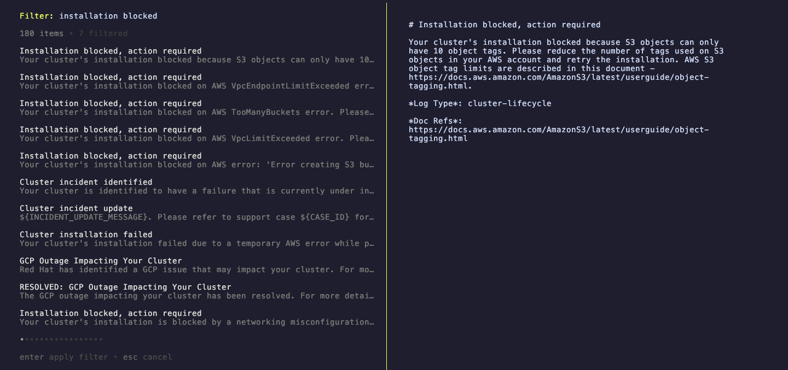
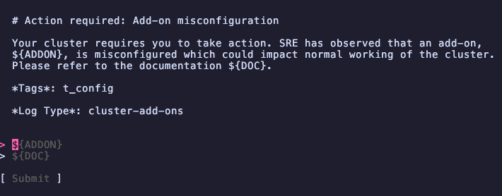
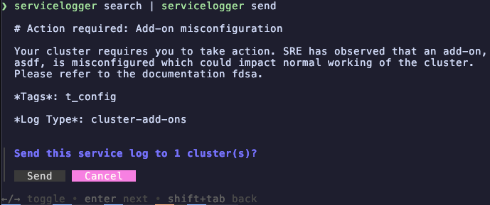
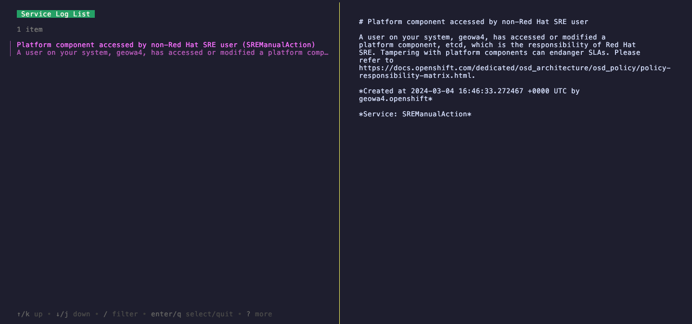

# Service Logger

This utility aims to provide a rich experience for viewing and sending service logs.
Many of the commands will launch an interactive terminal UI.

## Usage

Most options, such as `--cluster-id`, `--ocm-url`, and `--ocm-token` can be specified as environment variables.
Flags can also be included in a config file whose default config file location is `~/.config/servicelogger/config.yaml`.
It's probably not a good idea to place the cluster ID there though.

### Search

First, you'll need to download (or update) your cache of our SOPs and managed notifications.
```shell
servicelogger cache-update 
```

Then, you can run the search program and have it output the template JSON.
```shell
servicelogger search
```

This will launch a TUI listing all service log templates from your cache.


Type `/` to filter the logs.
Templates that match the text you type will be sorted by Levenshtein distance.


Once you select a template, you will be prompted with an editor to fill in the variables.


### Send

Most commonly, you will want to pipe the output of the `search` command to the `send` command.
```shell
servicelogger search | servicelogger send
```


### List View

The list view is similar to the search view but for service logs that have already been sent to the cluster.
```shell
servicelogger list
```

